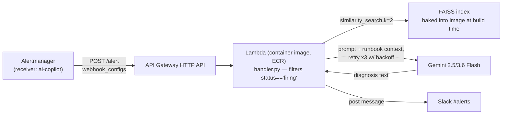

## Alert → AI Copilot Flow


> Part of a 4-repo GitOps setup. See [sre-platform](https://github.com/Tamal-tm/sre-platform)
> for the full architecture, infra setup, and end-to-end demo.


```markdown
## Prerequisites
- AWS account  
- Terraform >= 1.5  
- Docker 23+ (BuildKit)  
- AWS CLI  
- Gemini API key (Google AI Studio free tier)  
- Slack incoming webhook URL  

## Steps

### 1. Build the runbook index (one-time, offline)
```bash
cd ai-incident-copilot
python build_index.py   # embeds runbooks/ into a local FAISS index at faiss_index/
```

### 2. Build and push the Lambda image
```bash
# --provenance/--sbom disabled: Lambda's container runtime rejects the
# multi-manifest OCI image index that Docker BuildKit adds by default
docker buildx build --provenance=false --sbom=false --platform linux/amd64 \
  -t ai-incident-copilot:latest . --load

aws ecr get-login-password --region ap-south-1 | \
  docker login --username AWS --password-stdin <account-id>.dkr.ecr.ap-south-1.amazonaws.com

docker tag ai-incident-copilot:latest <account-id>.dkr.ecr.ap-south-1.amazonaws.com/ai-incident-copilot:latest
docker push <account-id>.dkr.ecr.ap-south-1.amazonaws.com/ai-incident-copilot:latest
```

### 3. Deploy infra with Terraform
```bash
cd infra
terraform init
terraform apply   # NOTE: type the full word "yes" at the prompt — a bare "y" is treated as "no"
```

> Terraform pins the Lambda to the image’s immutable ECR digest — pushing a new image alone does **not** update the live Lambda; re-run `terraform apply` to pick up the new digest.

### 4. Wire Alertmanager to call it (values live in the monitoring namespace)
```bash
helm get values monitoring -n monitoring -o yaml > current-alertmanager-values.yaml
```

Edit `current-alertmanager-values.yaml` to add:

```yaml
receivers:
  - name: ai-copilot
    webhook_configs:
      - url:
        send_resolved: false

route:
  receiver: slack-notifications
  routes:
    - matchers: [alertname = "HighErrorBudgetBurn"]
      receiver: ai-copilot
      continue: true
    - matchers: [alertname = "HighErrorBudgetBurn"]
      receiver: slack-notifications
      continue: true
```

> Two sibling routes are required — a matched child route does **not** also fall back to the parent’s default receiver, even with `continue: true`.

```bash
helm upgrade monitoring prometheus-community/kube-prometheus-stack -n monitoring \
  -f current-alertmanager-values.yaml --reuse-values
```

### 5. Verify end-to-end
**Isolated test:**
```bash
curl -X POST https://dfp5rlyggb.execute-api.ap-south-1.amazonaws.com/alert \
  -H "Content-Type: application/json" \
  -d @test-event.json
```

**Real trigger (via Project 1’s chaos test):**
```bash
# Temporarily disable ArgoCD auto-sync
kubectl patch application sre-platform-app -n argocd --type merge \
  -p '{"spec":{"syncPolicy":null}}'

# Trigger chaos
kubectl set image deployment/service-b service-b=tamal23/service-b:v2-chaos-test -n sre-platform
```

> Generate load against `/greet` for several minutes (1‑hour burn‑rate window means a brief blip won’t cross the 14.4% threshold).

**Cleanup after alert fires:**
```bash
kubectl set image deployment/service-b service-b=tamal23/service-b:v3-stable -n sre-platform
kubectl patch application sre-platform-app -n argocd --type merge \
  -p '{"spec":{"syncPolicy":{"automated":{"prune":true,"selfHeal":true}}}}'
```

---

## Teardown & Cost — ai-incident-copilot
- **Lambda (container image):** billed per invocation + duration only, no idle cost. Free tier covers this project’s usage easily.  
- **ECR:** small per‑GB/month storage charge (~tens of MB) — negligible.  
- **API Gateway HTTP API:** $1.00 per million requests — effectively $0 at demo volume.  
- **Gemini API:** free tier (Google AI Studio) — $0.  
- **Total marginal cost:** effectively $0, by design (avoided Bedrock and OpenSearch Serverless).  

```bash
# Full teardown when done for good
cd infra
terraform destroy
aws ecr batch-delete-image --repository-name ai-incident-copilot --image-ids imageTag=latest
```
```

aws ecr batch-delete-image --repository-name ai-incident-copilot --image-ids imageTag=latest
\`\`\`
